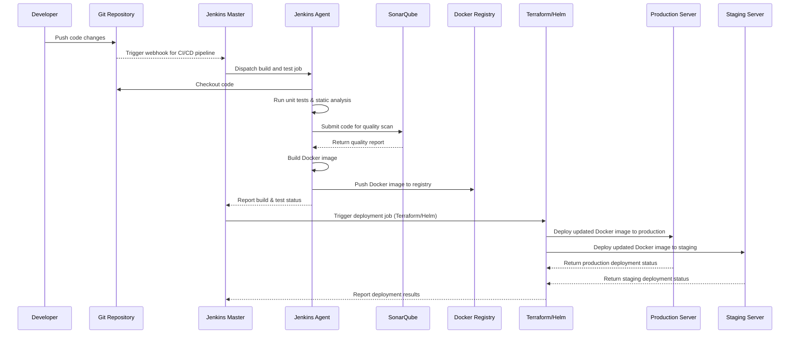

# CI/CD Pipeline Sequence Diagram

```mermaid
sequenceDiagram
    participant Dev as Developer
    participant Git as Git Repository
    participant JM as Jenkins Master
    participant JA as Jenkins Agent
    participant SQ as SonarQube
    participant DR as Docker Registry
    participant TH as Terraform/Helm
    participant PROD as Production Server
    participant STAGE as Staging Server

    Dev->>Git: Push code changes
    Git-->>JM: Trigger webhook for CI/CD pipeline
    JM->>JA: Dispatch build and test job
    JA->>Git: Checkout code
    JA->>JA: Run unit tests & static analysis
    JA->>SQ: Submit code for quality scan
    SQ-->>JA: Return quality report
    JA->>JA: Build Docker image
    JA->>DR: Push Docker image to registry
    JA-->>JM: Report build & test status
    JM->>TH: Trigger deployment job (Terraform/Helm)
    TH->>PROD: Deploy updated Docker image to production
    TH->>STAGE: Deploy updated Docker image to staging
    PROD-->>TH: Return production deployment status
    STAGE-->>TH: Return staging deployment status
    TH-->>JM: Report deployment results
```